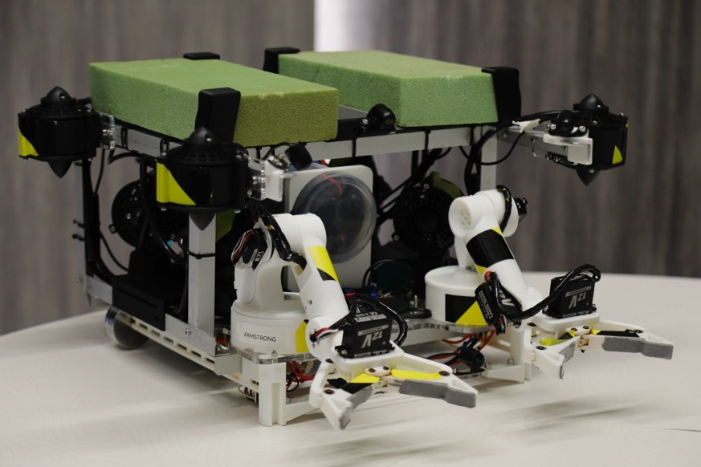

# Aquamarine ROV Control System

  


A comprehensive control system for underwater Remotely Operated Vehicles (ROVs), combining Python-based GUI control, Arduino firmware for motor/sensor management, and advanced stabilization algorithms.

## Features
- **Dual Robotic Arm Control**: PWM-driven manipulators with wrist/gripper control (left & right arm configurations).
- **Joystick Integration**: Xbox/PS4 controller support for thrusters and manipulators.
- **Real-time 3D Visualization**: Pygame-based GUI showing ROV orientation (roll/pitch/yaw), thruster output, and sensor data.
- **PID Stabilization**: Auto-leveling mode with dynamic calibration using IMU data.
- **Multi-protocol Communication**: RS485 serial for PWM signals, I2C for IMU (Wit Motion Sensor).
- **Modular Design**: Separate libraries for manipulators (`Manipulator_Library.py`), joystick handling, and GUI components.

## Hardware Requirements
- **Microcontroller**: Arduino Mega 2560 (running `Aquamarine_Arduino.ino`).
- **Motor Controller**: Pololu Maestro for PWM signal management.
- **IMU**: Wit Motion 10-axis sensor (integrated via I2C).
- **Thrusters**: 8x bidirectional thrusters (horizontal + vertical control).
- **Joystick**: XInput-compatible controller.

## Software Dependencies
- **Python 3.8+** with packages:
  ```bash
  pip install pygame pyserial numpy